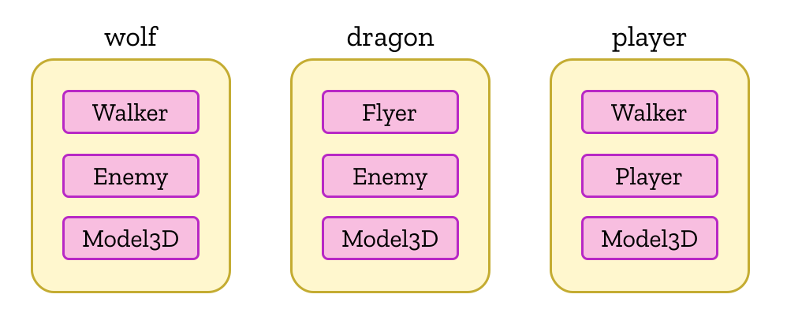

<language-switcher/>

# Entities
An entity is an object that has a unique ID, very much like a JavaScript object. Its purpose is to group components together; it may have up to one component of each type.



## Creating entities

You can create entities by invoking `createEntity` [on your world](./world#creating-entities) or [on a system](./systems#creating-entities).  You pass in the types of the components that you want the entity to start out with, each optionally followed by initial values to assign to the component's fields.

```js
world.createEntity(ComponentFoo, {foo: 'bar', baz: 42}, ComponentBar);
```
```ts
world.createEntity(ComponentFoo, {foo: 'bar', baz: 42}, ComponentBar);
```

It's also fine (if unusual) to create an entity with no components as a kind of placeholder.

## Adding components

Once an entity has been created, it is possible to add [components](./components) to it at any time:

```ts
@component class ComponentA {
  @field.int32 declare value: number;
}
@component class ComponentB {
  @field.dynamicString(20) declare message: string;
}

// in a system, given an entity:
entity.add(ComponentA, {value: 10});
// or add multiple components at once:
entity.addAll(ComponentA, {value: 10}, ComponentB, {message: 'hello'});
```
```js
class ComponentA {
  static schema = {
    value: Type.int32
  };
}
class ComponentB {
  static schema = {
    message: Type.dynamicString(20)
  };
}

// in a system, given an entity:
entity.add(ComponentA, {value: 10});
// or add multiple components at once:
entity.addAll(ComponentA, {value: 10}, ComponentB, {message: 'hello'});
```

The arguments to `add` and `addAll` are the same as those to `createEntity` above.

Trying to add the same component type to an entity more than once will result in an error.  Adding an [enum component type](components#component-enums) will automatically [remove](#removing-components) any other component from the same enum.

## Accessing and modifying components

Components can be accessed from an entity in two ways:
- `read(Component)`: get the component for read-only operations.  (Attempts to set field values will throw an error unless you're running in [performance mode](../deploying).)
- `write(Component)`: get the component to modify its field values.

```ts
@component class ComponentA {
  @field.int32 declare value: number;
}
@component class ComponentB {
  @field.int32 declare value: number;
}

// in a system, given an entity:
entity.write(ComponentA).value += entity.read(ComponentB).value;
```
```js
class ComponentA {
  static schema = {
    value: Type.int32
  };
}
class ComponentB {
  static schema = {
    value: Type.int32
  };
}

// in a system, given an entity:
entity.write(ComponentA).value += entity.read(ComponentB).value;
```

::: danger
You must not hang on to the component handles returned by `read` and `write`, as they'll be invalidated by the next call to `read` or `write` on the same component type.
:::

These two access modes help to implement [reactive queries](./queries#reactive-queries) with minimal overhead, allowing your systems to easily get lists of entities whose components have been mutated.  Note that the component will get marked as changed even if you don't change any fields, so try to use `write` only when you know you will actually modify the component and use `read` otherwise.

Keeping these two modes distinct also makes it clear how a system is acting on components, and allows Becsy's scheduler to automatically parallelize system execution without needing to use expensive and error-prone locks.

## Removing components

Another common operation on entities is to remove components:

```ts
entity.remove(ComponentA);
entity.removeAll(ComponentA, ComponentB);
```
```js
entity.remove(ComponentA);
entity.removeAll(ComponentA, ComponentB);
```

Removing an [enum](components#component-enums) from an entity will instead remove the entity's current enum component.  Trying to remove a component that an entity doesn't have will result in an error.

Removing a component makes it disappear from the entity immediately, but Becsy actually keeps it around until the end of the next frame.  This is done so that every system that needs to react to the removal gets a chance to access the data of removed components.  You can access recently removed components like this:

```ts{6}
world.build(sys => {
  const entity = sys.createEntity(ComponentA, {value: 10});
  entity.read(ComponentA).value;  // 10
  entity.remove(ComponentA);
  // entity.read(ComponentA).value;  // error!
  sys.accessRecentlyDeletedData();
  entity.read(ComponentA).value;  // 10
})
```
```js{6}
world.build(sys => {
  const entity = sys.createEntity(ComponentA, {value: 10});
  entity.read(ComponentA).value;  // 10
  entity.remove(ComponentA);
  // entity.read(ComponentA).value;  // error!
  sys.accessRecentlyDeletedData();
  entity.read(ComponentA).value;  // 10
})
```

However you cannot write to recently deleted components.

## Checking for components

While normally you'll use [queries](./queries) to select entities with the desired combination of components, sometimes you'll need to check explicitly whether an entity has a component or not.  This is useful when writing [validators](./components#validation) but can also be used to check whether a component needs to be added or removed.

There are a few methods available for these checks:
```ts
entity.has(ComponentA);
entity.hasSomeOf(ComponentA, ComponentB);
entity hasAllOf(ComponentA, ComponentB);
entity.hasAnyOtherThan(ComponentA, ComponentB);
entity.countHas(ComponentA, ComponentB, ComponentC);
```
```js
entity.has(ComponentA);
entity.hasSomeOf(ComponentA, ComponentB);
entity hasAllOf(ComponentA, ComponentB);
entity.hasAnyOtherThan(ComponentA, ComponentB);
entity.countHas(ComponentA, ComponentB, ComponentC);
```

All these methods respect `System.accessRecentlyDeletedData()`, in case you need to check whether a component was recently removed, but [reactive queries](./queries#reactive-queries) are usually better for this.

All of the above methods (except `hasAllOf`) will accept an [enum](components#component-enums) to stand in for all its member component types.  There's also an extra method for efficiently figuring out which component of an enum is currently present on the entity, if any:

```ts
entity.hasWhich(enumA);  // returns a component type or undefined
```
```js
entity.hasWhich(enumA);  // returns a component type or undefined
```

## Deleting entities

Unlike JavaScript objects, which are automatically disposed of when they're no longer referenced, entities must be explicitly deleted like so:

```ts
entity.delete();
```
```js
entity.delete();
```

Doing so will remove all components from the entity (triggering relevant [reactive queries](./queries#reactive-queries)) then delete the entity itself.  The system deleting an entity will need to hold `write` [entitlements](queries#declaring-entitlements) for all components on the entity.  If it's hard to predict the set of possible component types a common pattern is to delegate the deletion to a dedicated system:

```ts
@component class ToBeDeleted {}

@system class SystemA extends System {
  execute() {
    // Instead of entity.delete(), just tag it:
    entity.add(ToBeDeleted);
  }
}

@system class Deleter extends System {
  // Note the usingAll.write below, which grants write entitlements on all component types.
  entities = this.query(q => q.current.with(ToBeDeleted).usingAll.write);
  execute() {
    for (const entity of this.entities.current) entity.delete();
  }
}
```
```js
class ToBeDeleted {}

class SystemA extends System {
  execute() {
    // Instead of entity.delete(), just tag it:
    entity.add(ToBeDeleted);
  }
}

class Deleter extends System {
  constructor() {
    // Note the usingAll.write below, which grants write entitlements on all component types.
    this.entities = this.query(q => q.current.with(ToBeDeleted).usingAll.write);
  }

  execute() {
    for (const entity of this.entities.current) entity.delete();
  }
}
```

Deleting an entity that has already been deleted will result in an error.

## Holding on to entity objects

The entity objects returned from `createEntity` or obtained from [queries](./queries) are ephemeral: they are only guaranteed to remain valid until the system finishes executing.  Afterwards, they may be invalidated at any time even if the entity has not yet been deleted.  (It's fine to assign these ephemeral entities to a `ref` field, though, as it keeps track of the underlying entity directly.)

To keep an entity object for longer you need to "hold" it:
```ts{6}
@system class MySystem extends System {
  private myImportantEntity: Entity;

  initialize(): void {
    const newEntity = this.createEntity(Foo, Bar);
    this.myImportantEntity = newEntity.hold();
  }

  execute(): void {
    this.myImportantEntity.read(Foo);  // OK!
  }
}
```
```js{4}
class MySystem extends System {
  initialize(): void {
    const newEntity = this.createEntity(Foo, Bar);
    this.myImportantEntity = newEntity.hold();
  }

  execute(): void {
    this.myImportantEntity.read(Foo);  // OK!
  }
}
```

A held entity handle becomes invalid shortly after the underlying entity has been deleted, at which point trying to call any method on it will result in an error.  If the lifecycle of an entity held by a system is outside its control then you should check `entity.alive` every frame and stop referencing the entity once it becomes `false`.  You're guaranteed at least one frame where `entity.alive` is `false` and the handle is still valid, but if you miss the opportunity you're out of luck.
