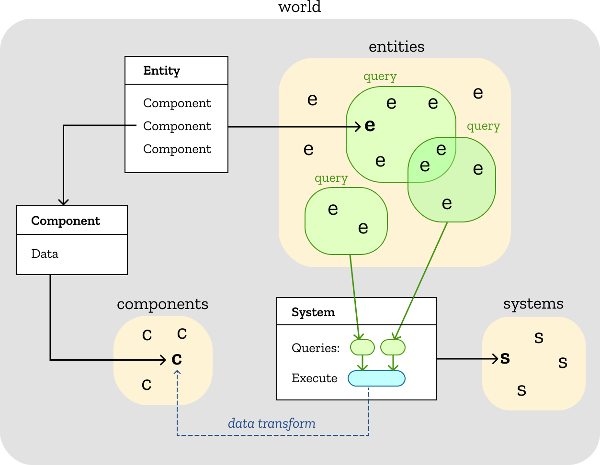
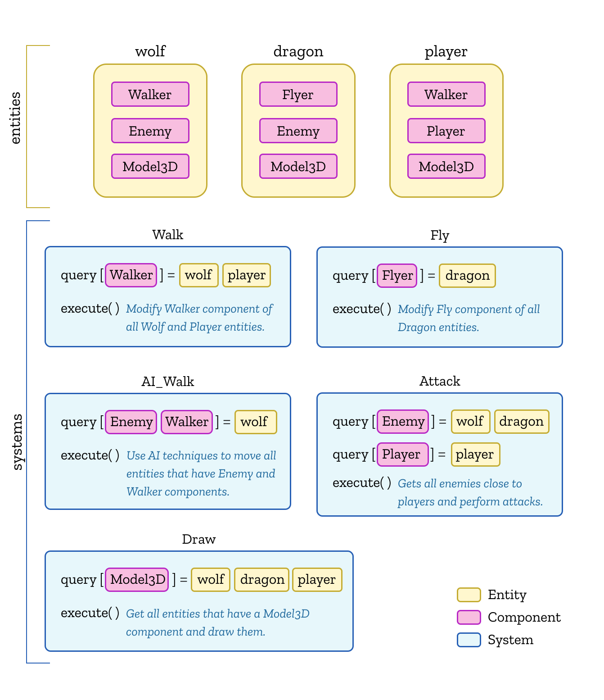

# Overview

ECS (Entity Component System) is an architectural pattern where computation is defined as a list of systems operating on a set of entities, each of which consists of a dynamic set of pure data components.  Systems select the entities to process via means of persistent, efficient queries over the entities' component "shapes".

Here's a short glossary cribbed from the [getting started guide](../getting-started) (which you should probably read first):
- [entities](./entities): an object with a unique ID that can have multiple components attached to it.
- [components](./components): different facets of an entity, e.g. geometry, physics, hit points. Data is only stored in components.
- [systems](./systems): pieces of code that do the actual work within an application by processing entities and modifying their components.
- [queries](./queries): used by systems to determine which entities they are interested in, based on the components attached to the entities.
- [world](./world): a container for entities, components, systems and queries.

The usual workflow when building an ECS based program:
1. Create the *component* types that shape the data you need to use in your application.
2. Create *entities* and attach *components* to them.
3. Create the *systems* that will use these *components* to read and transform the data of *entities* selected by a *query*.
4. Execute all the *systems* each frame.

## Example

Let's say we want to create a game where the player fights with wolves and dragons.
We will start by defining components that will be attached to entities:
- `Walker` and `Flyer` for entities that will walk and fly (respectively).
- `Enemy` for enemy entities.
- `Model3D` for all the entities that will have a 3D Model.

Then we use these components to define our main entities:
- `wolf`: It's an `Enemy`, can `walk` and has a `model3D`.
- `dragon`: It's an `Enemy`, can `fly` and has a `model3D`.
- `player`: It's an `Player`, can `walk` and has a `model3D`.

And finally we define the systems that will add the logic to the game:
- `Walk`: It will modify the `Walker` entities (`Player` and `Wolf`) moving them around.
- `Fly`: It will modify the `Flyer` entities (`Dragon`) moving them around in the sky.
- `AI_Walk`: It will modify the `Enemy` and `Walker` entities (`Wolf`) using AI techniques to compute the path they will follow.
- `Attack`: It will implement all the logic for attacks between `Enemy` and `Player` entities.
- `Draw`: It will draw all the entities that has `Model3D` component on the screen.

