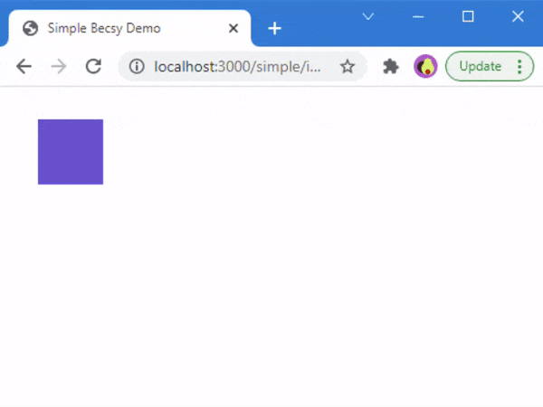

## Basic Example

The following example will demonstrate how to implement a simple object that will move on keyboard input.  It's strongly inspired by the nice example writeup from [nopun-ecs](https://github.com/grebaldi/nopun-ecs) (under the [MIT license](https://github.com/grebaldi/nopun-ecs/blob/master/LICENSE)).

This version of the example uses TypeScript but there's also a [plain JavaScript](../simple-js) version.

This example doesn't show any advanced rendering techniques and if you plan on writing an actual game you should use a library like [PixiJS](https://www.pixijs.com) or [BabylonJS](https://www.babylonjs.com/) to do the graphics part.  One of the many benefits of an ECS architecture is that it's not bound to a specific rendering technique, and could be used in a lot of different environments.

### Step 1 - The HTML file

We create an HTML file that will display a blue box.  This box will be the object that will be movable cursor keys.  We use [Vite](https://vitejs.dev/) to compile and serve our source but you can use any tool you'd like.

```
<!DOCTYPE html>
<html>
  <head>
    <title>Simple Becsy Demo</title>
    <meta name="viewport" content="width=device-width, initial-scale=1.0"/>
    <style>
      body {
        position: relative;
        padding: 0;
        margin: 0;
      }

      #object {
        position: absolute;
        width: 60px;
        height: 60px;
        background-color: slateblue;
      }
    </style>
    <script type="module" src="./src/main.ts"></script>
  </head>
  <body>
    <!-- This is the object that our demo will move around the page. -->
    <div id="object"></div>
  </body>
</html>
```

### Step 2 - Setting up the required components

For our source code proper, we first need a few components that hold the relevant data for us.  Since we want an object to move, that object must have a position and a velocity.  In order to translate those properties to the screen the object also needs a reference to its associated DOM node.

```
import {component, field, Type} from '@lastolivegames/becsy';

// Component types are declared as classes and don't need to inherit from anything in particular.
// We use the `@component` decorator to automatically register the component type with the world
// (created below).
@component class Position {
  // Each property needs a low level backing field type, as Becsy uses raw array buffers to share
  // data between workers (threads) rather than using objects to represent components.  To keep
  // TypeScript happy, we also use `declare` to expose the high level JavaScript type of each
  // property, whose implementation will be provided by Becsy.
  @field.float64 declare x: number;
  @field.float64 declare y: number;
}

@component class Velocity {
  // Velocity is also a two floats vector just like Position, but we nonetheless define it as a
  // separate component type.  Since an entity can have at most one instance of any given component
  // type this will allow an entity to have both a Velocity and a Position.  We could reuse property
  // names but prefer not to, as it will make code clearer later on.
  @field.float64 declare vx: number;
  @field.float64 declare vy: number;
}

@component class DOMRenderable {
  // We'll need a reference to the DOM node we set up in the HTML file in order to manipulate it
  // later on.
  @field.object declare node: HTMLElement;
}
```

### Step 3 - Setting up the input system

Like most games, our example is going to be processed sequentially on a frame-by-frame basis.  Each execution cycle of the ECS calculates one frame.  Unfortunately, this is not how input events are usually handled in the browser so we need a way to remedy that.

Our input system is going to remember every keystroke and remove that information again when a key is released.  This way, we can easily check which key is currently pressed on every frame.  Then we have a look at the arrow keys and transform the key names to the correct velocity values for our entity.

```
import {component, field, system, System, Type} from '@lastolivegames/becsy';

@component class Position {/* ... */}
@component class Velocity {/* ... */}
@component class DOMRenderable {/* ... */}


// Systems are declared as classes that extend `System`.  We use the `@system` decorator to
// automatically register the system type with the world, and `export` them so the linter won't
// complain about "unused" classes.
@system export class VelocityInputController extends System {
  // Every system can define any number of queries whose results will be available in the `execute`
  // method.  In this case, we're asking for all entities that currently have a Velocity component,
  // and declare that we'll be writing to those components.
  private readonly movables = this.query(q => q.current.with(Velocity).write);

  // Here we'll store all keys that are currently pressed.  This is not specific to ECS but it's a
  // common pattern to glue together event-driven (DOM) and timing-driven (ECS) processes.
  private readonly keysPressed = new Set<string>();

  // Every system can provide an `initialize` method that will be called once as the world is being
  // set up.  We'll use it to register our DOM event handlers.
  initialize(): void {
    document.addEventListener('keydown', (event: KeyboardEvent) => {
      this.keysPressed.add(event.key);  // add the pressed key to our set
    });

    document.addEventListener('keyup', (event: KeyboardEvent) => {
      this.keysPressed.delete(event.key);  // remove the released key from our set
    });
  }

  // Every system can (and probably should) provide an `execute` method that implements its logic.
  // It will be invoked once per frame in our demo, so at 60fps it's called 60 times per second.
  execute(): void {
    // We loop through the query results of the movables query we defined above.
    for (const movable of this.movables.current) {
      // This is how we access the data stored in the Velocity component of our movable entity.
      // We must specify whether we intend to only `read` the data or also to `write` it.  We'll
      // only be allowed to `write` to component types that we reserved as such in our queries.
      const velocity = movable.write(Velocity);

      if (this.keysPressed.has('ArrowUp')) velocity.vy = -100;  // in pixels per second
      else if (this.keysPressed.has('ArrowDown')) velocity.vy = 100;
      else velocity.vy = 0;

      if (this.keysPressed.has('ArrowLeft')) velocity.vx = -100;
      else if (this.keysPressed.has('ArrowRight')) velocity.vx = 100;
      else velocity.vx = 0;
    }
  }
}
```

### Step 4 - Setting up the movement system

Next we need a system that updates every entity that has a position and a velocity, for the velocity change in step 3 to take effect.

```
import {component, field, system, System, Type} from '@lastolivegames/becsy';

@component class Position {/* ... */}
@component class Velocity {/* ... */}
@component class DOMRenderable {/* ... */}

@system export class VelocityInputController extends System {/* ... */}

@system export class Movement extends System {
  // In this query we're looking for every entity with both a `Position` and a `Velocity` component,
  // but while we declare that we'll be writing to `Position` we'll only be reading from `Velocity`.
  // Reading from `Velocity` will automatically make this system run after `VelocityInputController`
  // which writes it, and writing to `Position` will put it before the `Renderer` which reads it.
  // The order that systems are declared in doesn't matter.
  private readonly movables =
    this.query(q => q.current.with(Velocity).and.with(Position).write);

  execute(): void {
    for (const movable of this.movables.current) {
      // We retrive both velocity (to read) and position (to write) from our entities.
      const velocity = movable.read(Velocity);
      const position = movable.write(Position);
      // In the execute method, a system has access to `this.delta`, which is the delta time between
      // the current frame and the previous one.  This allows us to calculate a stable movement
      // regardless of the intervals between our frames.  For more on that see
      // https://drewcampbell92.medium.com/understanding-delta-time-b53bf4781a03.
      position.x += this.delta * velocity.vx;
      position.y += this.delta * velocity.vy;
    }
  }
}
```

### Step 5 - Setting up the rendering system

The last system will take care of translating the position of our entity to its DOM node, so we can see the change on screen.

```
import {component, field, system, System, Type} from '@lastolivegames/becsy';

@component class Position {/* ... */}
@component class Velocity {/* ... */}
@component class DOMRenderable {/* ... */}

@system export class VelocityInputController extends System {/* ... */}
@system export class Movement extends System {/* ... */}

@system export class Renderer extends System {
  // This system will render any entity that has both a Position and a DOMRenderable component, and
  // that is new or whose position changed since the last frame. Note that we don't need to declare
  // DOMRenderable as writable since we'll be modifying the DOM element's properties rather than
  // updating the component's fields, and Becsy doesn't track that.
  private readonly renderables =
    this.query(q => q.addedOrChanged.with(DOMRenderable).and.with(Position).track);

  execute(): void {
    for (const renderable of this.renderables.addedOrChanged) {
      const {x, y} = renderable.read(Position);
      const {node} = renderable.read(DOMRenderable);
      // Sync the node's position from the entity by setting its style.
      node.style.left = `${x}px`;
      node.style.top = `${y}px`;
    }
  }
}
```

### Step 6 - Setting up the world

Now we have all the parts in place and it's time to stitch them together.  We create a world, which automatically picks up all the `@component`s and `@system`s declared earlier.  Then we create an entity with all 3 of our components in it.

```
import {component, field, system, System, Type, World} from '@lastolivegames/becsy';

@component class Position {/* ... */}
@component class Velocity {/* ... */}
@component class DOMRenderable {/* ... */}

@system export class VelocityInputController extends System {/* ... */}
@system export class Movement extends System {/* ... */}
@system export class Renderer extends System {/* ... */}

// We can now create the world that all our entities and their components will live in.  All system
// and component classes tagged with `@system` and `@component` will be automatically added to the
// world's `defs`, and in this case we don't need to add any other types manually.
const world = await World.create();

// Now we create the entity that will represent our object and add the components it will need.
// Each component type can be optionally followed by an object with initial field values.
world.createEntity(Position, Velocity, DOMRenderable, {node: document.getElementById('object')});
```

### Step 7 - Setting up the game loop

Last but not least we implement a basic game loop using `requestAnimationFrame` and execute our world within that loop.

```
import {component, field, system, System, Type, World} from '@lastolivegames/becsy';

@component class Position {/* ... */}
@component class Velocity {/* ... */}
@component class DOMRenderable {/* ... */}

@system export class VelocityInputController extends System {/* ... */}
@system export class Movement extends System {/* ... */}
@system export class Renderer extends System {/* ... */}

const world = await World.create();
/* ... */

// Finally, we set up our game loop.  The `run` function will be executed once per frame.
async function run() {
  // Execute the world, which will call the `execute` method of all systems in sequence.  The call
  // is asynchronous and we _must_ await its result, otherwise errors won't be reported properly.
  await world.execute();
  // Continue the loop on the next animation frame.
  requestAnimationFrame(run);
}
// Kick things off with our first frame!
requestAnimationFrame(run);
```

### Done!

The result should look like this:



You can check out the full example, including the necessary build setup, in [examples/simple](https://github.com/lastolivegames/becsy/blob/master/examples/simple).
